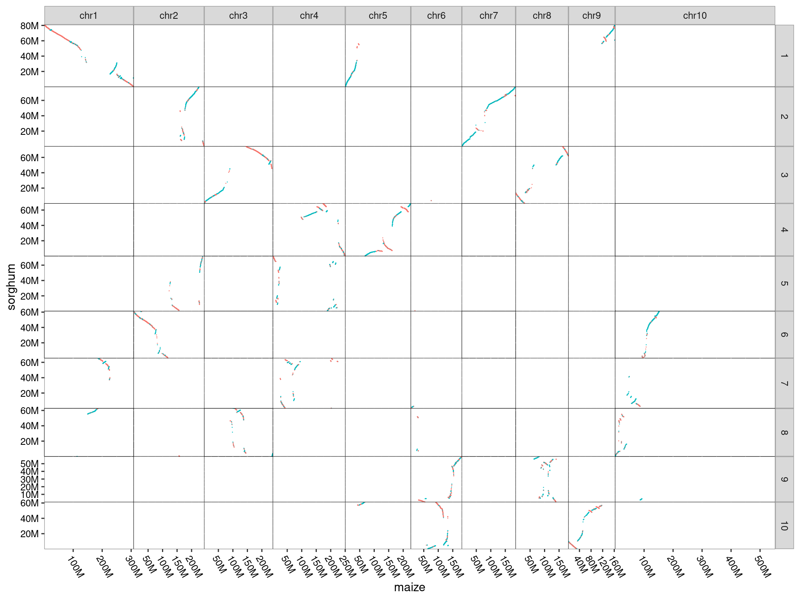
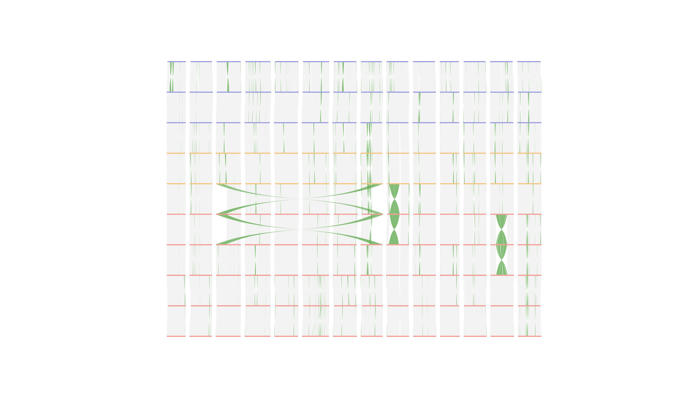

# AnchorWave anchors result visualization

## Dotplot visualization

The length of the query and reference corresponding to each facet is equal to the actual chromosome length.

## Example

### maize(query) fai file

The following is part maize fai file and in order to determine whether the length of `chr10` has been modified to the actual chromosome length(152M->552M).

```text
chr1    308452471    6    80    81
chr2    243675191    312308139    80    81
chr3    238017767    559029276    80    81
chr4    250330460    800022272    80    81
chr5    226353449    1053481869    80    81
chr6    181357234    1282664743    80    81
chr7    185808916    1466288949    80    81
chr8    182411202    1654420483    80    81
chr9    163004744    1839111832    80    81
chr10    552435371    2004154143    80    81
```

### sorghum(reference) fai file

The following is part sorghum fai file.

```text
1    80884392    71    60    61
2    77742459    82232608    60    61
3    74386277    161270846    60    61
4    68658214    236896966    60    61
5    71854669    306699555    60    61
6    61277060    379751873    60    61
7    65505356    442050289    60    61
8    62686529    508647472    60    61
9    59416394    572378848    60    61
10    61233695    632785589    60    61
```

### R code

```R
library(ggplot2)
changetoM <- function ( position ){
  position=position/1000000;
  paste(position, "M", sep="")
}
plot_total <- function (anchors_file, query_fai, ref_fai, query_label, ref_label, output_file){
  # read fai file. (first and second column)
  query_fai <- read.table(query_fai, header=F)
  query_length <- query_fai[, 1:2]
  colnames(query_length) <- c("queryChr", "length")
  query_length$queryChr <- as.character(query_length$queryChr)
  query_length$length <- as.integer(query_length$length)
  query_string_vector <- query_length$queryChr
  
  ref_fai <- read.table(ref_fai, header=F)
  ref_length <- ref_fai[, 1:2]
  colnames(ref_length) <- c("refChr", "length")
  ref_length$refChr <- as.character(ref_length$refChr)
  ref_length$length <- as.integer(ref_length$length)
  ref_string_vector <- ref_length$refChr
  
  # get blank df
  blank_df <- data.frame(matrix(nrow = 0, ncol = 4))
  for (i in 1:nrow(ref_length)) {
    refRowData <- ref_length[i, ]
    refChr <- refRowData[1, "refChr"]
    refChrLength <- refRowData[1, "length"]
    for (j in 1:nrow(query_length)) {
      queryRowData <- query_length[j, ]
      queryChr <- queryRowData[1, "queryChr"]
      queryChrLength <- queryRowData[1, "length"]
      new_row <- c(refChr, refChrLength, queryChr, queryChrLength)
      new_row_zero <- c(refChr, 0, queryChr, 0)
      blank_df <- rbind(blank_df, new_row)
      blank_df <- rbind(blank_df, new_row_zero)
    }
  }
  
  blank_colnames <- c("refChr", "refLength", "queryChr", "queryLength")
  colnames(blank_df) <- blank_colnames
  
  # convert column's class(factor and integer)
  blank_df$refLength <- as.integer(blank_df$refLength)
  blank_df$queryLength <- as.integer(blank_df$queryLength)
  blank_df$refChr <- factor(blank_df$refChr, levels = ref_string_vector)
  blank_df$queryChr <- factor(blank_df$queryChr, levels = query_string_vector)
  
  # read anchors file generated from AnchorWave.
  data = read.table(anchors_file, header=T)
  print(data)
  data$refChr <- as.character(data$refChr)
  data$queryChr <- as.character(data$queryChr)
  data = data[which(data$refChr %in% ref_string_vector),]
  data = data[which(data$queryChr %in% query_string_vector),]
  
  data$refChr = factor(data$refChr, levels = ref_string_vector)
  data$queryChr = factor(data$queryChr, levels = query_string_vector)
  
  plot = ggplot(data=data, aes(x=queryStart, y=referenceStart))+
    facet_grid(refChr~queryChr, scales = "free", space = "free")+
    geom_point(size=0.5, aes(color=strand)) + 
    geom_blank(data=blank_df, aes(x=queryLength, y=refLength)) +
    theme_grey(base_size = 30) +
    labs(x=query_label, y=ref_label)+scale_x_continuous(labels=changetoM, expand=c(0, 0)) + scale_y_continuous(labels=changetoM, expand=c(0, 0)) +
    theme(axis.line = element_blank(),
          panel.spacing = unit(0, "mm"),
          strip.background = element_rect(color = "white"),
          panel.background = element_blank(),
          panel.border = element_rect(fill=NA,color="black", linewidth=0.5, linetype="solid"),
          axis.text.y = element_text( colour = "black"),
          legend.position='none',
          axis.text.x = element_text(angle=300, hjust=0, vjust=1, colour = "black") )
  png(output_file , width=2000, height=1500)
  print(plot)
  dev.off()
}
plot_total("anchors", "query.fai", "ref.fai", "query", "ref", "anchors.png")
```

### Dotplot

<p align="center">

</p>

## line style visualization

You can vis multiple anchors file by raw_line_proali module

```bash
git clone git@github.com:xiaodli/AnchorWave_proali_vis.git
cd raw_line_proali
python main.py line_proali -c line.conf
```
  
Note:
The following is `line.conf` file.

```text
[line]
collinearity = 1.Kronos_Svevo.anno.3.anchormove,2.Svevo_XM001097.anno.3.anchormove,3.XM001097_NU00021.anno.3.anchormove,4.NU00021_IG77365.anno.3.anchormove,5.IG77365_IG99236.anno.3.anchormove,6.IG99236_PI294478.anno.3.anchormove,7.PI294478_NU01905.anno.3.anchormove,8.NU01905_NU01954.anno.3.anchormove,9.NU01954_Zavitan.anno.3.anchormove
# fig from bottom to top (ref:Kronos, query:Svevo, ref:Svevo:query:XM001097, ref:XM001097:query:NU00021)
length_file = Kronos.length.txt,Svevo.length.txt,XM001097.length.txt,NU00021.length.txt,IG77365.length.txt,IG99236.length.txt,PI294478.length.txt,NU01905.length.txt,NU01954.length.txt,Zavitan.length.txt
prefix = Kronos,Svevo,XM001097,NU00021,IG77365,IG99236,PI294478,NU01905,NU01954,Zavitan
remove_chromosome_prefix = ""
text_font_size = 7
savefig = ten.line.png
```

1. The following is length file(chr and length column is necessary and tab sep).

```text
chr  length  total_gene
1A  611319266  3772
1B  749393777  4158
2A  793380695  4950
2B  832257163  5398
3A  762016299  4530
3B  864951163  4947
4A  766591834  4214
4B  703924636  3578
5A  721915144  4785
5B  734861517  4869
6A  633522200  3588
6B  742827932  3996
7A  761831191  4622
7B  762926078  4011
```

2. prefix is species name.

3. remove_chromosome_prefix is chromosome prefix(comma separated).

### line plot

<p align="center">

</p>
